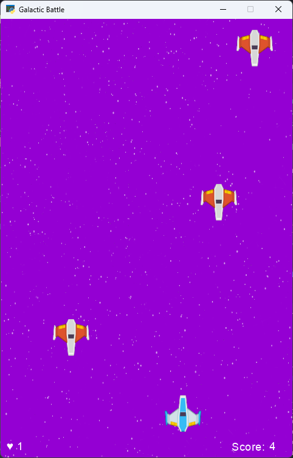

# Galactic Battle

This is a simple space game built using the Arcade library in Python that invites you to battle against alien enemies.



## Setup

Python and the Arcade library must be installed on your system to run the game. You can install the Arcade library using:

```
pip install arcade
```


Then run the code:

```bash
python main.py
```


## Controls

- Use **A** and **D** keys to move the spaceship left and right.
- Use **Space** key to shoot.

## Features

- Movement of the spaceship to the left and right.
- Firing bullets towards enemies.
- Keeping track of scores and lives.
- Displaying "GAME OVER" upon game completion.

## Additional Resources

- [Arcade Library](https://api.arcade.academy/en/latest/index.html)
- [Python Documentation](https://docs.python.org/)
