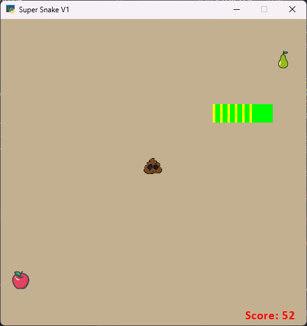

Super Snake V1
==============

Welcome to Super Snake V1, a simple snake game implemented in Python using the [Arcade](https://arcade.academy/) library.

Game Overview
-------------

Super Snake V1 is a classic snake game where the player controls a snake that moves around the screen to eat different types of fruits. Each fruit has a different score value, and the goal is to achieve the highest score possible. Be cautious of boundaries and obstacles, as colliding with them will end the game.

Game Features
-------------

*   **Fruits:**
    
    *   **Apple:** Score +1
    *   **Pear:** Score +2
    *   **Poo (Poop):** Score -1
*   **Scoring:**
    
    *   Eating fruits increases the player's score.
    *   Colliding with poop decreases the score.
    *   Game over if the player goes out of bounds.

How to Play
-----------

*   Use the arrow keys (UP, DOWN, LEFT, RIGHT) to control the snake's direction.
*   Eat fruits to increase your score.
*   Avoid collisions with poop and the game boundaries.

Game Development Files
----------------------

### main.py

`main.py` is the main script that initializes and runs the game. It handles user input, updates the game state, and renders the graphics.

### fruit.py

`fruit.py` defines the `Fruit` class and its subclasses (`Apple`, `Pear`, `Poo`). Fruits are sprites with different score values.

### snake.py

`snake.py` contains the `Snake` class, representing the player-controlled snake. It manages the snake's movement, size, and scoring.

Running the Game
----------------

Ensure you have Python and the Arcade library installed. Run the game using the following command:

bashCopy code

`python main.py`

Screenshots
-----------

You can include screenshots of the game to showcase its appearance. To add an image to this README:

Acknowledgments
---------------

*   This game is developed using the Arcade library: [Arcade - Python Arcade Library](https://arcade.academy/)

Feel free to customize and enhance the game as needed. Enjoy playing Super Snake V1!
