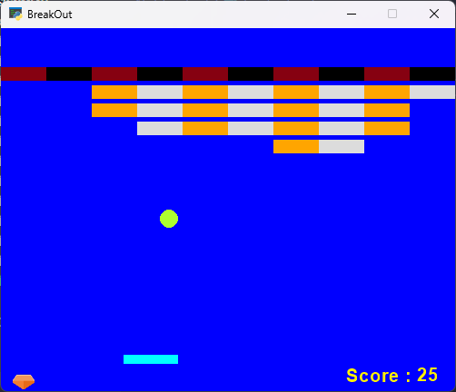
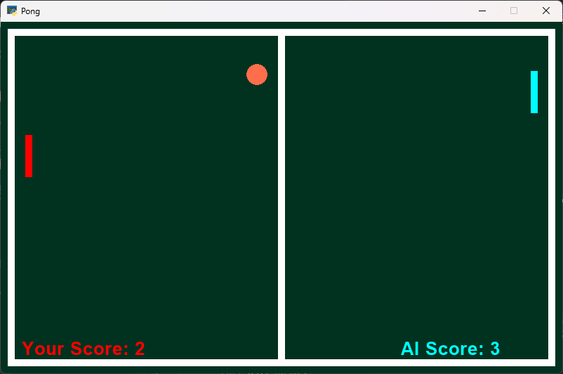

Sure, here is a README file in Markdown format for the Python files in the "breakout" and "pong" folders:

## Breakout

Breakout is a classic arcade game where you control a paddle to bounce a ball against bricks. The goal of the game is to break all of the bricks before the ball falls off the bottom of the screen.

### Files

* ball.py: ball.py: Ball class that represents the ball in the game
* brik.py: brik.py: Brik class that represents the bricks in the game
* board.py: board.py: Board class that represents the paddle in the game
* heart.py: heart.py: Heart class that represents the player's lives
* breakout.py: breakout.py: Main game class that runs the game

## Pong

Pong is a classic two-player arcade game where two players control paddles to hit a ball back and forth across a net. The goal of the game is to hit the ball so that it bounces off your opponent's paddle and goes into their goal.

### Files

* ball.py: ball.py: Ball class that represents the ball in the game
* rocket.py: rocket.py: Rocket class that represents the player's paddle
* pong.py: pong.py: Main game class that runs the game