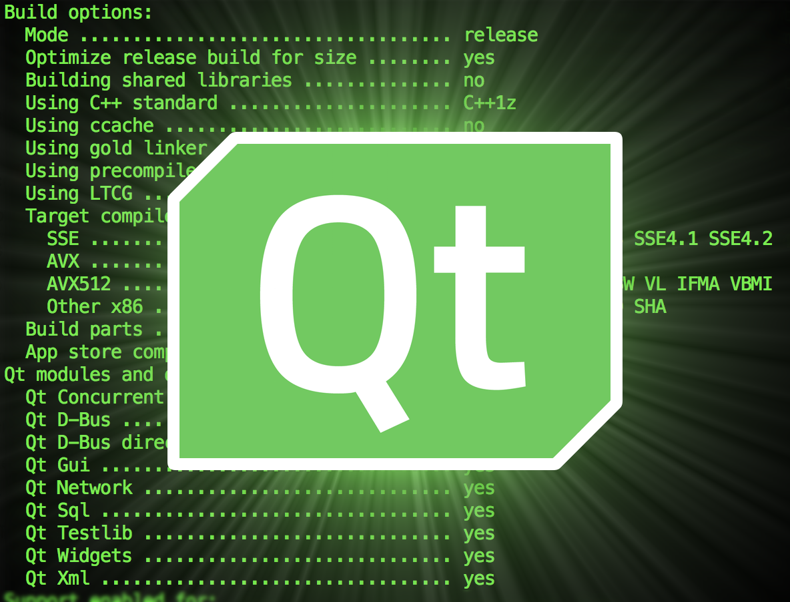

<div align="center" id="top"> 
  

  &#xa0;

  <!-- <a href="https://pylearn.netlify.app">Demo</a> -->
</div>

<h1 align="center">Qt Assignment</h1>

<!-- Status -->

<!-- <h4 align="center"> 
	🚧  Pylearn 🚀 Under construction...  🚧
</h4> 

<hr> -->

<p align="center">
  <a href="#dart-about">About</a> &#xa0; | &#xa0; 
  <a href="#sparkles-features">Features</a> &#xa0; | &#xa0;
  <a href="#rocket-technologies">Technologies</a> &#xa0; | &#xa0;
  <a href="#checkered_flag-starting">Starting</a> &#xa0; | &#xa0;
  <a href="https://github.com/{{YOUR_GITHUB_USERNAME}}" target="_blank">Author</a>
</p>

<br>

## About ##

This folder contains four different projects written in Python using the Qt framework:

1. Puzzle 15:

    A classic puzzle game where you need to slide numbered tiles into their correct positions.

2. Downloader:

    A simple application that lets you download files by providing a link.

3. Password Generator:

    A utility that generates passwords of varying difficulty levels (easy, medium, hard).

4. Guess the Number:

    A game where the program chooses a number and the user has 10 attempts to guess it.


## Features ##

**1. Puzzle 15:**

A classic puzzle game where you need to slide numbered tiles into their correct positions.

**2. Downloader:**

A simple application that lets you download files by providing a link.

**3. Password Generator:**

A utility that generates passwords of varying difficulty levels (easy, medium, hard).

**4. Guess the Number:**

A game where the program chooses a number and the user has 10 attempts to guess it.

## Technologies ##

The following tools were used in this project:

- [Python](https://www.python.org/)
- [Qt](https://www.qt.io/)

## Starting ##

```bash
# Clone this project
$ git clone https://github.com/Seyed-Alireza-Kargar/pylearn

# open to base directory
$ cd pylearn

# open to assignment
$ cd 19
```

Made with :heart: by <a href="https://github.com/Seyed-Alireza-Kargar" target="_blank">Seyed Alireza Kargar</a>

&#xa0;

<a href="#top">Back to top</a>
