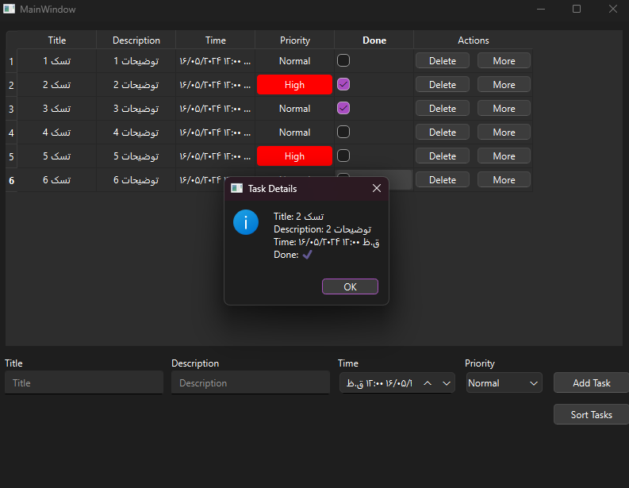

# Task Manager Application

This project is a task management application built using PySide6 for the user interface and SQLite for database storage.



Project Structure
==

```
.
├── Codes
│ ├── main.py
│ ├── database.py
│ ├── main_window.py
│ └── main_window.ui
├── App
│ ├── build
│ ├── dist
│ └── main.spec
└── README.md
```

#### **Codes**: This directory contains the source code of the project.
   * **main.py**: The main file that runs the application.
   * **database.py**: The database management file.
   * **main\_window.py**: The file containing the logic for the user interface.
   * **main\_window.ui**: The UI design file created with Qt Designer.

#### **App**: This directory contains files and folders related to building the executable of the project.
   * **build/**: A temporary directory used by PyInstaller during the build process.
   * **dist/**: The directory where the final executable is placed.
   * **main.spec**: The PyInstaller spec file.

</br>

Prerequisites
==

#### *Before running the project, ensure you have the following packages installed:*

**1 - Python 3.x**
</br>
**2 - PySide6**
</br>
**3 - PyInstaller**

#### You can install these packages using the following commands:
```
pip install pyside6
pip install pyinstaller
```

</br>

Running the Application
==

#### To run the application, navigate to the Codes directory and execute the following command:

```
python main.py
```
</br>

Building the Executable
==
#### To build the executable using PyInstaller, navigate to the Codes directory and run the following command:

```
pyinstaller --onefile main.py
```

#### After the process is complete, the executable file will be located in the dist directory.

</br>

Using the Executable
==

#### To use the executable file: 1. Navigate to the `App/dist` directory. 2. Locate the `main.exe` file. 3. Double-click `main.exe` to run the Task Manager application without needing to run the Python script.

</br>

Development
==

#### If you want to develop the application further, you can edit the files in the Codes directory. After making changes, you can rebuild the executable using PyInstaller.

</br>

Contribution
==

#### If you wish to contribute to this project, please use the Issues and Pull Requests features on GitHub to get in touch.


</br>