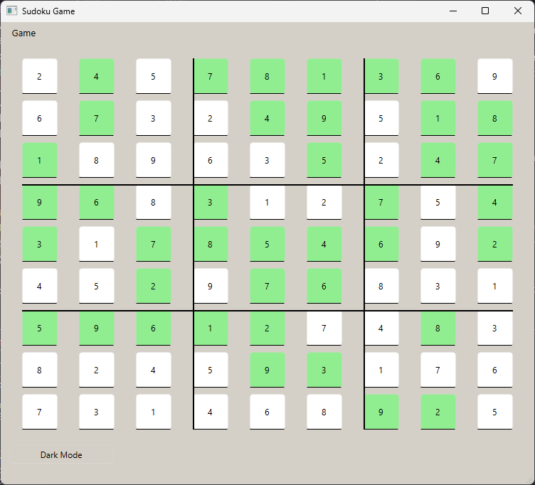

# Sudoku Game

A desktop Sudoku game application built with PySide6. This project is designed for the Pylearn course and provides features such as starting a new game, loading a game from a file, solving the puzzle, and toggling dark mode.

## Features

- Generate a new Sudoku puzzle
- Load a Sudoku puzzle from a file
- Solve the current Sudoku puzzle
- Toggle dark mode

## Installation

1. Clone the repository:

   ```
   git clone https://github.com/Seyed-Alireza-Kargar/Pylearn
   cd 23
   ```

2. Install the required dependencies:
   ```
   pip install -r requirements.txt
   ```

3. Run the application:
   ```
   python main.py
   ```

## Building an Executable

To build a standalone executable using PyInstaller:

1. Ensure PyInstaller is installed:
   ```
   pip install pyinstaller
   ```

2. Build the executable:
   ```
   pyinstaller --onefile main.py
   ```

3. The executable will be located in the `dist` directory.

## Known Issues

1. **Layout Warning**: When running the project, the following warning messages may appear:

```
QGridLayout: Multi-cell fromRow greater than toRow
QGridLayout: Multi-cell fromRow greater than toRow
```

This warning is related to the layout management in the UI and does not affect the functionality of the game.

2. **Grid Separator Lines**: The separator lines in the Sudoku grid are not perfectly aligned. If you have a solution to improve the accuracy of these lines, please consider contributing.

## Contributing

If you encounter any issues or have suggestions for improvements, feel free to open an issue or submit a pull request on GitHub. Contributions to fix the known issues mentioned above are especially welcome.

## Usage

- **New Game**: Start a new Sudoku puzzle.
- **Open File**: Load a Sudoku puzzle from a file. Use the provided `s1.txt` file for testing this feature.
- **Solve**: Automatically solve the current Sudoku puzzle.
- **Dark Mode**: Toggle between light and dark mode for the application.

## Screenshot


